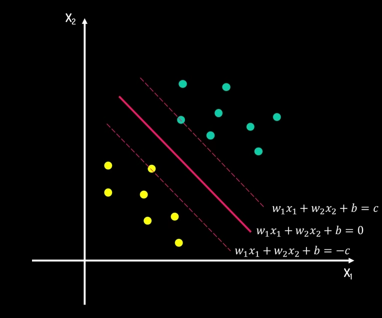
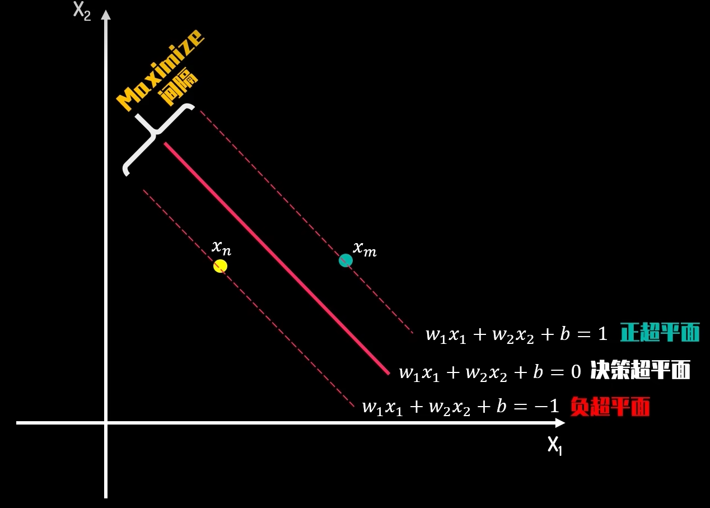
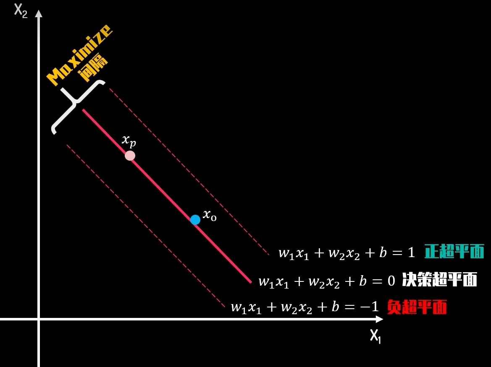
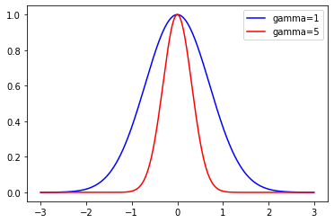
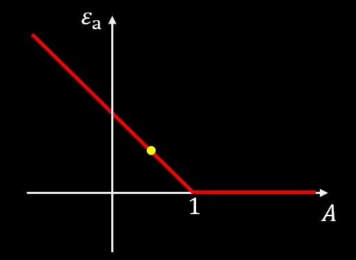
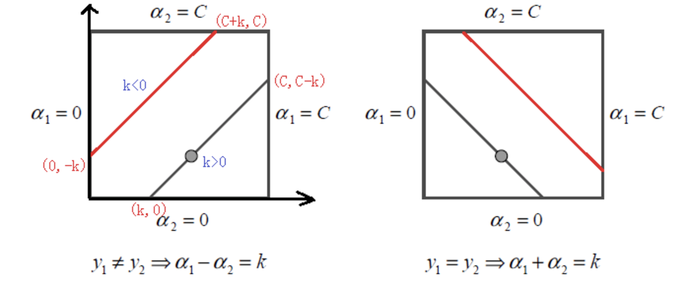

# 第三周 | Third Week：SVM（支持向量机）

## SVM公式推导

### 问题简化

已知n个样本，样本维度为m，如何求得一个**超平面（hyperplane）**$\sum\limits_{i=1}^mW_iX_i+B=0$将两类样本分隔开来。最佳决策边界，即求解两类数据的最大间隔问题。而间隔的正中，就是我们的决策边界。**支持向量（Support Vector）**就是距离分隔超平面最近的那些点。

写出决策边界和间隔上下边界方程，两边同除C：
$$
w_{1} x_{1}+w_{2} x_{2}+b=c \quad \frac{w_{1}}{c} x_{1}+\frac{w_{2}}{c} x_{2}+\frac{b}{c}=1 \\
w_{1} x_{1}+w_{2} x_{2}+b=0 \quad \quad \frac{w_{1}}{c} x_{1}+\frac{w_{2}}{c} x_{2}+\frac{b}{c}=0 \\
w_{1} x_{1}+w_{2} x_{2}+b=-c \quad \frac{w_{1}}{c} x_{1}+\frac{w_{2}}{c} x_{2}+\frac{b}{c}=-1 \\
$$
作变量代换
$$
w_{1}^{\prime}=\frac{w_{1}}{c} \quad w_{2}^{\prime}=\frac{w_{2}}{c} \quad b^{\prime}=\frac{b}{c} \\
$$
w,b只是代号，可以不用写成$w'$的形式，可得：
$$
w_{1} x_{1}+w_{2} x_{2}+b=1  \\ 
w_{1} x_{1}+w_{2} x_{2}+b=0 \\
w_{1} x_{1}+w_{2} x_{2}+b=-1
$$
依次为：**正超平面，决策超平面，负超平面**。现在我们要最大化两者距离。

$x_m,x_n$位于正负超平面上，满足：
$$
(1) w_{1} x_{1 \mathrm{~m}}+w_{2} x_{2 \mathrm{m}}+b=1 \\
(2) w_{1} x_{1 \mathrm{n}}+w_{2} x_{2 \mathrm{n}}+b=-1 \\
$$
(1) - (2) 得：
$$
(3) w_{1}\left(x_{1 \mathrm{~m}}-x_{1 n}\right)+w_{2}\left(x_{2 \mathrm{~m}}-x_{2 n}\right)=2 \\
$$
即：
$$
(4) \vec{w} \cdot\left(\vec{x}_{m}-\vec{x}_{n}\right)=2
$$
同理我们选取位于决策超平面上的点O，P：

同理可得：
$$
(5) w_{1} x_{1o}+w_{2} x_{2o}+b=0 \\
(6) w_{1} x_{1 p}+w_{2} x_{2 p}+b=0 \\
(5) - (6): w_{1}\left(x_{1o}-x_{1 p}\right)+w_{2}\left(x_{2o}-x_{2p}\right)=0 \\
(7) \vec{w} \cdot\left(\vec{x}_{o}-\vec{x}_{p}\right)=0 \\
$$
即$\vec{w}$是决策超平面的法向量。因此（4）式等价于：
$$
\left\|\vec{x}_{m}-\vec{x}_{n}\right\| * \cos \theta *\|\vec{w}\|=2 \\
$$
而我们要求的间隔为：
$$
\left\|\vec{x}_{m}-\vec{x}_{n}\right\| * \cos \theta=L \\
$$
因此：
$$
&L *\|\vec{w}\|=2 \\
&L=\frac{2}{\|\vec{w}\|}
$$
位于正超平面上侧的点满足：
$$
\left\{
\begin{aligned}
&y_{i}=1 \\
&\vec{w} \cdot \vec{x}_{i}+b \geq 1
\end{aligned}
\right.
$$
式中$y_i$为分类值，同理负超平面下侧的点满足：
$$
\left\{
\begin{aligned}
&y_{i}=-1 \\
&\vec{w} \cdot \vec{x}_{i}+b \leq 1
\end{aligned}
\right.
$$
故约束条件可以进一步简化为：
$$
y_{i}*(\vec{w} \cdot \vec{x}_{i}+b) \geq 1
$$
可得优化问题：
$$
\operatorname{minimize}\|\vec{w}\|
$$
其中：
$$
\|\vec{w}\|=\sqrt{w_{1}^{2}+w_{2}^{2}}
$$
### KKT条件

为方便计算，令$f(w)=\frac{\|\vec{w}\|^{2}}{2}$,可得
$$
\operatorname{minimize} \quad f(w)=\frac{\|\vec{w}\|^{2}}{2}
$$
约束条件为：
$$
g_i(w,b)=y_i*(\vec{w} \cdot \vec{x_i}+b) - 1 \geq0 \quad i=1,2,\cdots,s,\text{s为样本数}
$$
为使用Lagrange数乘法，令
$$
g_i(w,b)=p_i^2
$$
得到如下得Lagrange方程式：
$$
L\left(w, b, \lambda_{i}, p_{i}\right)=\frac{\|\vec{w}\|^{2}}{2}-\sum_{i=1}^{s} \lambda_{i} *\left(y_{i} *\left(\vec{w} \cdot \vec{x}_{i}+b\right)-1-p_{i}^{2}\right)求偏导得：
$$
对$w,b,\lambda_i,p_i $求偏导得：

$$
(1) \vec{w}-\sum_{i=1}^{S} \lambda_{i} y_{i} \vec{x}_{i}=0\\
(2) -\sum_{i=1}^{s} \lambda_{i} y_{i}=0\\
(3) y_{i} *\left(\vec{w} \cdot \vec{x}_{i}+b\right)-1-p_{i}^{2}=0\\
(4) 2 \lambda_{i} p_{i}=0 \Longrightarrow \lambda_{i} p_{i}^{2}=0\\
$$
对（4）变形得：
$$
(4) 2 \lambda_{i} p_{i}=0 \Longrightarrow \lambda_{i} p_{i}^{2}=0\\
$$
将（3）带入（4）得：
$$
\lambda_{i}\left(y_{i} *\left(\vec{w} \cdot \vec{x}_{i}+b\right)-1\right)=0
$$
注意到：
$$
y_{i} *\left(\vec{w} \cdot \vec{x}_{i}+b\right) \geq 1
$$
故有：
$$
\left\{
\begin{array}{cl}
 y_{i} *\left(\vec{w} \cdot \vec{x}_{i}+b\right)-1>0, \lambda_{i}=0 \\
 y_{i} *\left(\vec{w} \cdot \vec{x}_{i}+b\right)-1=0, \lambda_{i} \neq 0
\end{array}
\right.
$$
再看
$$
L\left(w, b, \lambda_{i}, p_{i}\right)=\frac{\|\vec{w}\|^{2}}{2}-\sum_{i=1}^{s} \lambda_{i} *\left(y_{i} *\left(\vec{w} \cdot \vec{x}_{i}+b\right)-1-p_{i}^{2}\right)
$$
将$\lambda_i$看成违背约束条件得惩罚系数，不满足约束条件时,$(\vec{w} \cdot \vec{x_i}+b) - 1 < 0$,如果$\lambda_i<0$,相当于Lagrange函数最后会变得更小，鼓励违反约束而获得更小的解，这不符合常理，可以推断出：
$$
\lambda_i \geq 0
$$
最后我们得到以下五个条件，即**KKT条件**
$$
\left\{
\begin{aligned}
&\vec{w}-\sum_{i=1}^{s} \lambda_{i} y_{i} \vec{x}_{i}=0 \\
&-\sum_{i=1}^{s} \lambda_{i} y_{i}=0 \\
&y_{i} *\left(\vec{w} \cdot \vec{x}_{i}+b\right)-1 \geq 0 \\
&\lambda_{i}\left(y_{i} *\left(\vec{w} \cdot \vec{x}_{i}+b\right)-1\right)=0 \\
&\lambda_{i} \geq 0
\end{aligned}
\right.
$$

### SVM对偶性

原问题：
$$
\begin{aligned}
&\operatorname{minimize} \quad f(w)=\frac{\|\vec{w}\|^{2}}{2}\\
&\operatorname{subject to} \quad g_i(w,b)=y_i*(\vec{w} \cdot \vec{x_i}+b) - 1 \geq0 \quad i=1,2,\cdots,s,\text{s为样本数}
\end{aligned}
$$
问题有最优解$w^*,b^*$

构造：
$$
q\left(\lambda_{i}\right)=\text { minimize }\left(L\left(w, b, \lambda_{i}\right)\right)=\text { minimize }\left(f(w)-\sum_{i=1}^{s} \lambda_{i} * g_{i}(w, b)\right), \quad i=1,2,3,4 \ldots s \\
$$
必然有：
$$
q\left(\lambda_{i}\right)=\text { minimize }\left(L\left(w, b, \lambda_{i}\right)\right)=\text { minimize }\left(f(w)-\sum_{i=1}^{s} \lambda_{i} * g_{i}(w, b)\right) \leq \boldsymbol{f}\left(\overrightarrow{\boldsymbol{w}^{*}}\right)-\sum_{i=1}^{s} \lambda_{i} * \boldsymbol{g}_{i}\left(\overrightarrow{\boldsymbol{w}^{*}}, \boldsymbol{b}^{*}\right) \\
$$
根据KKT条件：
$$
\left\{
\begin{aligned}
&\lambda_{i} \geq 0 \\
&g_{i}\left(\overrightarrow{w^{*}}, b^{*}\right) \geq 0
\end{aligned}
\right.
$$
$\boldsymbol{f}\left(\overrightarrow{\boldsymbol{w}^{*}}\right)$所减项为正，故有
$$
q\left(\lambda_{i}\right) \leq f\left(\overrightarrow{w^{*}}\right) \leq f(w)
$$
寻找最优下界：让$q(\lambda_i^*)$与$f(\vec{w^*})$尽可能的接近，有：
$$
q\left(\lambda_{i}\right) \leq q\left(\lambda_{i}^{*}\right) \leq f\left(\overrightarrow{w^{*}}\right) \leq f(w)
$$
故原问题可以等价于如下的对偶问题：
$$
\begin{aligned}
&\operatorname{minimize}\quad q\left(\lambda_{i}\right)=\operatorname{maximize}\left(\operatorname{minimize}\left(L\left(w, b, \lambda_{i}\right)\right)\right)\\
&\operatorname{subject to} \quad \lambda_{i} \geq 0, \quad i=1,2,3,4, \ldots ,s
\end{aligned}
$$
当$q\left(\lambda_{i}^{*}\right) < f\left(\overrightarrow{w^{*}}\right)$时，称为弱对偶；当$q\left(\lambda_{i}^{*}\right) = f\left(\overrightarrow{w^{*}}\right)$时，称为强对偶，可以证明当强对偶条件成立时原问题和对偶问题同时达到最优解。即：
$$
\begin{array}{ll}
f(w) \geq q\left(\lambda_{i}^{*}\right)=f\left(\overrightarrow{w^{*}}\right) & f(w) \geq f\left(\overrightarrow{w^{*}}\right) \\
f(w) \geq q\left(\lambda_{i}^{*}\right)=f\left(\overrightarrow{w^{*}}\right) \geq q\left(\lambda_{i}\right) & q\left(\lambda_{i}^{*}\right) \geq q\left(\lambda_{i}\right)
\end{array}
$$
由此，对偶问题可化为：
$$
\operatorname{minimize}\quad q(\lambda)=\operatorname{maximize}\left(\right.\operatorname{minimize}\left.\left(\frac{\|\vec{w}\|^{2}}{2}-\sum_{i=1}^{s} \lambda_{i} *\left(y_{i} *\left(\vec{w} \cdot \vec{x}_{i}+b\right)-1\right)\right)\right)\\
\operatorname{subject to}\quad \lambda_{i} \geq 0, \quad i=1,2,3,4 \ldots s
$$
带入KKT条件（1），（2）得：
$$
\left.\operatorname{maximize} \quad q\left(\lambda_{i}\right)=\operatorname{maximize}\left(\frac{1}{2}\left(\sum_{i=1}^{s} \lambda_{i} y_{i} \vec{x}_{i}\right) \cdot\left(\sum_{j=1}^{s} \lambda_{j} y_{j} \vec{x}_{j}\right)-\sum_{i=1}^{s} \lambda_{i} *\left(y_{i} *\left(\left(\sum_{j=1}^{s} \lambda_{j} y_{j} \vec{x}_{j}\right) \cdot \vec{x}_{i}+b\right)-1\right)\right)\right)
$$
即：
$$
\operatorname{maximize} q\left(\lambda_{i}\right)=\operatorname{maximize}\left(\sum_{i=1}^{s} \lambda_{i}-\frac{1}{2} \sum_{i=1}^{s} \sum_{j=1}^{s} \lambda_{i} \lambda_{j} y_{i} y_{j} \overrightarrow{\boldsymbol{x}}_{\boldsymbol{i}} \cdot \overrightarrow{\boldsymbol{x}}_{\boldsymbol{j}}\right)
$$
我们可以通过支持向量求解$\lambda_i^*$，再由KKT（1）求得w，再求得b，便达成我们的目的。

### SVM核技巧 | Kernel Trick

求解$\lambda_i^*$，取决于$y_{i} y_{j} \overrightarrow{\boldsymbol{x}}_{\boldsymbol{i}} \cdot \overrightarrow{\boldsymbol{x}}_{\boldsymbol{j}}$,若方程在原维度无解(非线性)，可以通过构造维度转换函数T（x）,得到新的维度数据向量T（x）,可以得到如下的优化问题：
$$
\operatorname{maximize} q\left(\lambda_{i}\right)=\operatorname{maximize}\left(\sum_{i=1}^{S} \lambda_{i}-\frac{1}{2} \sum_{i=1}^{s} \sum_{j=1}^{s} \lambda_{i} \lambda_{j} y_{i} y_{j} T\left(\vec{x}_{i}\right) \cdot T\left(\vec{x}_{j}\right)\right)\\ \operatorname{subject to} \quad \lambda_{i} \geq 0, \quad i=1,2,3,4 \ldots S
$$
如果先求出T（x）,再将其点积，当数据维度为无穷维时，无法求解，故我们引入核函数$K\left(\vec{x}_{i}, \vec{x}_{j}\right)$，使得：
$$
T\left(\vec{x}_{i}\right) \cdot T\left(\vec{x}_{j}\right)=K\left(\vec{x}_{i}, \vec{x}_{j}\right) = \left(c+\vec{x}_{i}\cdot \vec{x}_{j}\right)^d
$$
当我们需要做如下的维度转化:
$$
\vec{x}=\left(x_{1}, x_{2}\right) \stackrel{T}{\longrightarrow} T(\vec{x})=\left(a_{1} x_{1}, a_{1} x_{2}, a_{1} x_{1} x_{2}, a_{2} x_{1}^{2}, a_{2} x_{2}^{2}, \ldots a_{n} x_{2}^{n}, a_{n} x_{2}^{n}, \ldots \infty\right)
$$
我们可以引入**高斯核函数（Radial Basis Kernel）**：
$$
K\left(\vec{x}_{i}, \vec{x}_{\boldsymbol{j}}\right)=e^{-\gamma\left\|\vec{x}_{i}-\vec{x}_{j}\right\|^{2}}
$$
当gamma确定后，两点的距离越大，其相似度越接近于0；两点的距离越小，其相似度越接近于1。

令$\gamma = 0.5$,作如下推导：
$$
\begin{aligned}
&K\left(\vec{x}_{i}, \vec{x}_{j}\right) \\
&=e^{-\frac{\left\|\vec{x}_{i}-\vec{x}_{j}\right\|^{2}}{2}} \\
&=e^{-\frac{1}{2}\left(\vec{x}_{i}-\vec{x}_{j}\right) \cdot\left(\vec{x}_{i}-\vec{x}_{j}\right)} \\
&=e^{-\frac{1}{2}\left(\vec{x}_{i} \cdot \vec{x}_{i}+\vec{x}_{j} \cdot \vec{x}_{j}-2 \vec{x}_{i} \cdot \vec{x}_{j}\right)} \\
&=e^{-\frac{1}{2}\left(\left\|\vec{x}_{i}\right\|^{2}+\left\|\vec{x}_{j}\right\|^{2}-2 \vec{x}_{i} \cdot \vec{x}_{j}\right)} \\
&=e^{-\frac{1}{2}\left(\left\|\vec{x}_{i}\right\|^{2}+\left\|\vec{x}_{j}\right\|^{2}\right)} e^{\vec{x}_{i} \cdot \vec{x}_{j}}
\end{aligned}
$$
令$C =e^{-\frac{1}{2}\left(\left\|\vec{x}_{i}\right\|^{2}+\left\|\vec{x}_{j}\right\|^{2}\right)}  $,Taylor展开得：
$$
K\left(\vec{x}_{i}, \vec{x}_{j}\right)=C e^{\vec{x}_{i} \cdot \vec{x}_{j}}=C \sum_{n=0}^{\infty} \frac{\vec{x}_{i} \cdot \vec{x}_{j}^{n}}{n !}=C \sum_{n=0}^{\infty} \frac{K_{P o l y(n)}\left(\vec{x}_{i}, \vec{x}_{j}\right)}{n !}
$$

### 软间隔 | SoftMargin

如果出现一个点a违法了约束条件$y_{i} *\left(\vec{w} \cdot \vec{x}_{i}+b\right) \geq 1$，即：
$$
y_{i} *\left(\vec{w} \cdot \vec{x}_{i}+b\right) < 1
$$
为了量化点a误差，引入：
$$
\varepsilon_{\mathrm{a}}=1-y_{\mathrm{a}} *\left(\vec{w} \cdot \vec{x}_{a}+b\right)
$$
令
$$
A = y_{\mathrm{a}} *\left(\vec{w} \cdot \vec{x}_{a}+b\right)
$$
很显然有：

对于任意点i，其损失值可以用如下得损失函数表示：
$$
\varepsilon_{i}=\max \left(0,1-y_{i} *\left(\vec{w} \cdot \vec{x}_{i}+b\right)\right)
$$
我们称之为合页损失函数（Hinge Loss Function）

对于软间隔得最优化问题，有：
$$
\text { minimize } f(w)=\frac{\|\vec{w}\|^{2}}{2}+\sum_{i=1}^{s} \varepsilon_{i} \quad \text { 其中 } \varepsilon_{i}=\max \left(0,1-y_{i} *\left(\vec{w} \cdot \vec{x}_{i}+b\right)\right)
$$
而$\varepsilon_{i}$等价于：
$$
\begin{aligned}
&y_{i} *\left(\vec{w} \cdot \vec{x}_{i}+b\right)+\varepsilon_{i} \geq 1 \\
&\varepsilon_{i} \geq 0
\end{aligned}
$$
在实际操作中，我们会对目标函数的损失值部分乘一个非负的参数C，因为我们的目标是求函数的最小值解，C可以让我们控制对损失值$\varepsilon_{i}$的容忍度。故最终得问题转化为：
$$
\text { minimize } f(w)=\frac{\|\vec{w}\|^{2}}{2}+C\sum_{i=1}^{s} \varepsilon_{i} \quad \text { 其中 } \varepsilon_{i}=\max \left(0,1-y_{i} *\left(\vec{w} \cdot \vec{x}_{i}+b\right)\right)
$$

## 代码实现

### 算法原理：

优化一系列的α的值，每次选择尽量少的 α 来优化，不断迭代直到函数收敛到最优值。

#### 优化α：

假设对 α1,α2 进行优化：在不考虑约束条件的情况下，经过推导可以得出：
$$
α_2^{new}=α_2^{old}+\cfrac{y_2(E_1−E_2)}η
$$
但是存在约束条件
$$
\sum\limits_{i=1}^n\alpha_iy_i=0
$$
故：
$$
\begin{aligned}
&\alpha_{1} y_{1}+\alpha_{2} y_{2}=-\sum_{i=3}^{N} \alpha_{i} y_{i}=\zeta \\
&0 \leq \alpha_{i} \leq C
\end{aligned}
$$
 此约束为方形约束(Bosk constraint), 在二维平面中我们可以看到这是个限制在方形区域中的直线

(如左图) 当 $y_{1} \neq y_{2}$ 时，线性限制条件可以写成: $\alpha_{1}-\alpha_{2}=k$ ，根据 $k$ 的正负可以得到不同 的上下界，因此统一表示成:

- 下界: $L=\max \left(0, \alpha_{2}^{\text {old }}-\alpha_{1}^{\text {old }}\right)$

- 上界: $H=\min \left(C, C+\alpha_{2}^{\text {old }}\right.$ $\left.-\alpha_{1}^{\text {old }}\right)$

(如右图) 当 $y_{1}=y_{2}$ 时，限制条件可写成: $\alpha_{1}+\alpha_{2}=k$ ，上下界表示成:

- 下界: $L=\max \left(0, \alpha_{1}^{\text {old }}+\alpha_{2}^{\text {old }}-C\right)$
- 上界: $H=\min \left(C, \alpha_{2}^{\text {old }}+\alpha_{1}^{\text {old }}\right)$

根据得到的上下界，我们可以得到修剪后的 $\alpha_{2}^{\text {new }}$ :
$$
\alpha_{2}^{\text {new }}= \begin{cases}H & \alpha_{2}^{\text {new,unclipped }}>H \\ \alpha_{2}^{\text {new,unclipped }} & L \leq \alpha_{2}^{\text {new }, \text { unclipped }} \leq H \\ L & \alpha_{2}^{\text {new,unclipped }}<L\end{cases}
$$
得到了 $\alpha_{2}^{\text {new }}$ 我们便可以根据 $\alpha_{1}^{\text {old }} y_{1}+\alpha_{2}^{\text {old }} y_{2}=\alpha_{1}^{\text {new }} y_{1}+\alpha_{2}^{\text {new }} y_{2}$ 得到 $\alpha_{1}^{\text {new }}$ :
$$
\alpha_{1}^{\text {new }}=\alpha_{1}^{\text {old }}+y_{1} y_{2}\left(\alpha_{2}^{\text {old }}-\alpha_{2}^{\text {new }}\right)
$$

#### 更新阈值b

> 当我们更新了一对 $\alpha_{i}, \alpha_{j}$ 之后都需要重新计算阈值 $b$ ，因为 $b$ 关系到我们 $f(x)$ 的计算，关系到下次优化的时候误差 $E_{i}$ 的计算。

为了使得被优化的样本都满足KKT条件：

当 $\alpha_{1}^{n e w}$ 不在边界，即 $0<\alpha_{1}^{n e w}<C$ :根据KKT条件可知相应的数据点为支持向量，满足
$$
y_{1}\left(w^{T}+b\right)=1
$$
两边同时乘上 $y_{1}$ 得到 
$$
\sum_{i=1}^{N} \alpha_{i} y_{i} K_{i, 1}+b=y_{1}
$$
进而得到 $b_{1}^{n e w}$ 的值: 
$$
b_{1}^{n e w}=y_{1}-\sum_{i=3}^{N} \alpha_{i} y_{i} K_{i, 1}-\alpha_{1}^{n e w} y_{1} K_{1,1}-\alpha_{2}^{n e w} y_{2} K_{2,1}
$$
其中上式的前两项可以写成:
$$
y_{1}-\sum_{i=3}^{N} \alpha_{i} y_{i} K_{i, 1}=-E_{1}+\alpha_{1}^{\text {old }} y_{1} K_{1,1}+\alpha_{2}^{\text {old }} y_{2} K_{2,1}+b^{\text {old }}
$$

当 $0<\alpha_{2}^{\text {new }}<C$ 时，可以得到$b^{new}_2$:
$$
b_{2}^{\text {new }}=-E_{2}-y_{1} K_{1,2}\left(\alpha_{1}^{\text {new }}-\alpha_{1}^{\text {old }}\right)-y_{2} K_{2,2}\left(\alpha_{2}^{\text {new }}-\alpha_{2}^{\text {old }}\right)+b^{\text {old }}
$$
当 $b_{1}$ 和 $b_{2}$ 都有效的时候他们是相等的， 即 
$$
b^{n e w}=b_{1}^{n e w}=b_{2}^{n e w}
$$
当两个乘子 $\alpha_{1}, \alpha_{2}$ 都在边界上，且 $L \neq H$ 时， $b 1, b 2$ 之间的值就是和KKT条件一直的阈值。 SMO选择他们的中点作为新的阈值:
$$
b^{\text {new }}=\frac{b_{1}^{n e w}+b_{2}^{n e w}}{2}
$$

#### 选择变量$\alpha$:

- 在**整个样本集**和**非边界样本集**间进行交替，选择第一个变量$\alpha_1$（外循环)
- 在列表中选择具有 |E1−E2| 的 α2 来近似最大化步长。
- 不断地在两个数据集中来回交替，最终所有的 α 都满足KKT条件的时候，算法中止

## 参考文献：

- 《机器学习实战》Chapter6
- [数之道：支持向量机SVM的本质及其几何解释](https://www.bilibili.com/video/BV16T4y1y7qj?share_source=copy_web&vd_source=c491121fc72d328cd54fad55aa30d19f)
- SMO_simple与SMO_Platt的有关资料
- 利用搜索引擎能搜索到的我能明白的所有资料
